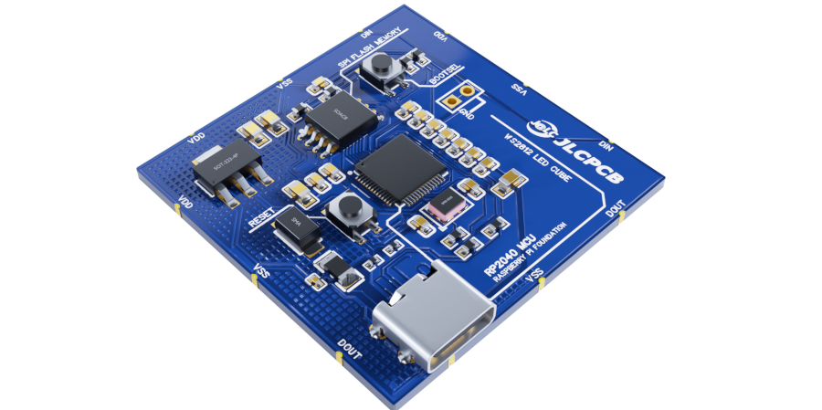
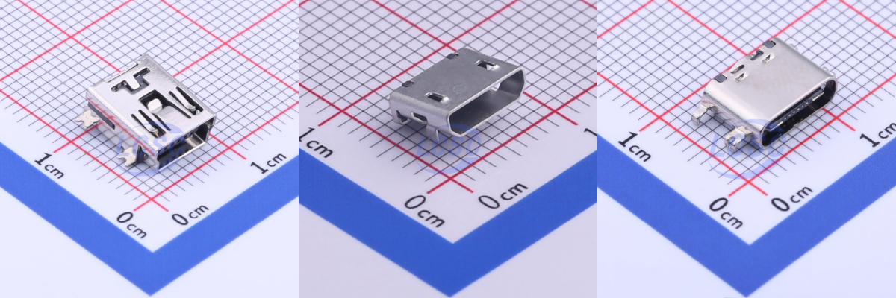

# Why SMT Process Matters To PCB Designers

<!--  -->

If a bug was found on a software product, it's certainly caused by the developer. If an assembled PCB had a fabrication or assembly issue, who would be responsible for it?

* A good PCB designer makes a design with no error, and if it is fabricated and assembled by an expensive manufacturing line, it works well.
* A smart PCB designer makes a design that any cheap SMT assembly machine can assemble with no issue.

A PCB designer thinks about packages and footprints from the beginning of a design.
He/she takes care of heat dissipation using vias and copper areas, calculates length matching and impedance of differential pair routes.
Thermal and electromagnetic knowledge and senses are fundamentals of all PCB design work.

But there's one more thing needed - SMT Process.
Just like we don't need to know all of the vast electromagnetic theory, we also don't need to understand every detail of the SMT process.
But knowing only a few key steps will turn a good PCB designer into a professional.
There are many factors to make SMT process esier and less buggy.

These would be trivial and no need further explanation.
* not too small parts, using tiny components only when they're needed
* enough gap between components
* enough margin from board outline

But the following factors are still less known.

## Pick and Place: What Makes It Fail

After applying the soldering paste using a stencil, the next step is component placement, which is done by the pick-and-place machine.

Pick-and-place machines have nozzles and feeders. The quality of nozzles and feeders define the quality of the process.
The components are picked and held by a vacuum nozzle.
But not all components are pickable with a vacuum nozzle.

For example, some micro or mini USB SMD connectors have holes on the top surface. Such holes make the vacuum nozzle fail to pick.
For safe picking in mass production, the USB Type-C connector is better because it has no hole on the top surface.

<!--  -->

<figure>

<figcaption align = "center"><b>USB Connectors Comparison</b> USB Type-C connector is the safest for SMT pick-and-place process</figcaption>
</figure>

Buzzers, speakers, tactile button switches are other examples of hard-to pick components for pick-and-place machines.
For these components, contact the PCB manufacturer to ensure that these components will not cause serious assembling issues on mass production.

## Reflow Soldering and/or Wave Soldering

Though the pick-and-place process successfully placed all components, it doesn't mean soldering will go well.
To increase the soldering success rate, one needs to understand reflow soldering and wave soldering.
Some PCBs should path through both processes, while other PCBs require a reflow process only.

Process | Reflow soldering | Wave soldering
--------|------------------|---------------
Pb-free | lead-free components | leaded components
mounting type | mainly used for surface-mounted components | mainly used for through-hole components
temperature | higher than 250 °C | 210 - 220 °C
thermal conducting | by hot nitrogen gas | by melted solder

As the reflow soldering temperature is higher, the wave soldering follows after the reflow process.
If reflow soldering comes after the wave soldering, some components may detach due to the higher temperature of reflow soldering.
The manufacturer controls the processing orders.
But if a designer cares about some factors, the soldering gets easier and more reliable.

* Do not mix lead-free components and lead components if possible. If so, only the reflow soldering can assemble all.
* When both components are needed, minimize mixing by grouping lead-free components and leaded components with each other. An easy approach is placing through-hole components far from the lead-free SMD components.
* Put heavy components only on one side. For double-sided PCBs, heavy parts can be detached more easily while soldering the opposite side.

---

Jan 24th, 2022  
Hotte Shen
