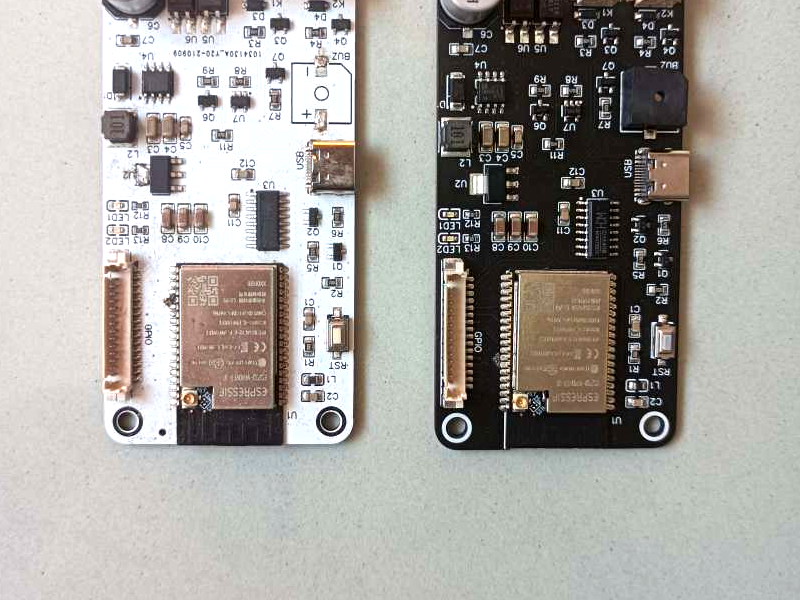
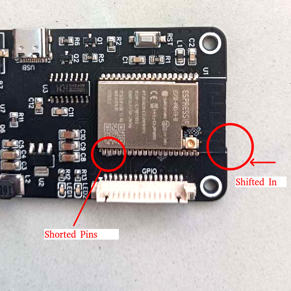
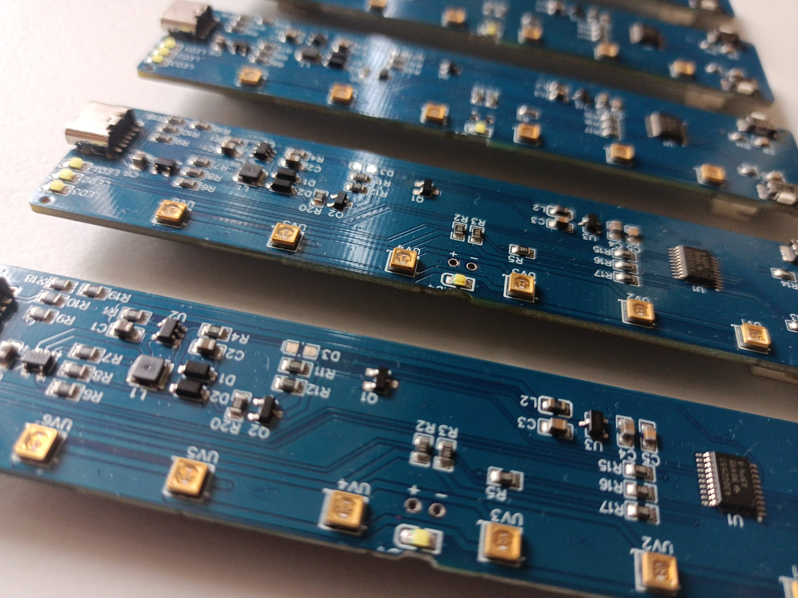

# JLCPCB PCBA Service vs Hand Soldering

For the prototyping stage, it is common to assemble components by hand soldering. For small numbers of PCBs used for prototyping, this may be reasonable. But even for small quantities, hand soldering causes assembly problems quite often.
Despite such possible bugs, hand soldering is still considered the most affordable option for decreasing development costs.

JLCPCB is becoming a game-changer in the PCB prototyping field. It provides PCBA Service at competitive pricing. If a designer cares about choosing components from their basic library, the total PCBA cost is cheap. And with a few components from the external library.

But even though JLCPCB’s PCBA price is very affordable, it is still higher than the bare PCB + Components cost. If not accounting the value of time spent for hand-soldering by oneself.
So what makes us choose JLCPCB PCBA Service over hand soldering? It is the quality.

Here I introduce two showcases of some common issues of hand soldering.

## Visible Fault: Shifted Component Placing Makes Pins Shorted

Figure 1 shows two different PCBs.
At first, I ordered 5 bare PCBs from JLCPCB and assembled them by hand.
But while testing, I found one buggy board.
I could not flash the firmware on one board.
It ws the black PCB (right black board in Figure 1).

It may be not so clear at the first sight, we can see the ESP32 module is assembled differently in each board.
By the design, the edge of the ESP32 module should be an exact fit with the board edge.
But on the right black board, the ESP32 module is shifted in.

<figure style="width:100%; max-width: 400px">

<figcaption align = "center"><b>Figure 1. An IoT device with ESP32-WROVER module: assembled by JLCPCB (left white board) and hand soldering (right black board)</b></figcaption>
</figure>

<figure style="width:100%; max-width: 400px">

<figcaption align = "center"><b>Figure 2. Some pins of ESP32 module are shorted to adjacent pins, because the module is shifted while hand soldering</b></figcaption>
</figure>

As a result, some of the ESP32 pins were shorted.
Those pins were wired into the internal flash memory of the ESP32 module, thus, I was unable to write firmware.

Later, I ordered JLCPCB's PCBA service with the same design, 20 qty.
All the 20 boards came with no such bugs.
It was the white board shown in the left of Figure 2.

## Invisible Fault: Detached Pads on Component's Bottom Side

Figure 3 is showing PCBs with UVC LEDs assembled.
These UVC LEDs have solder pads on the bottom side, similar to BGA.
For the first prototyping, I used JLCPCB's PCBA service, and the prototype worked well as it was designed.

<figure style="width:100%; max-width: 400px">

<figcaption align = "center"><b>Figure 3. UVC driving board, assembled by JLCPCB PCBA service. All LEDs worked good.</b></figcaption>
</figure>

But the problem came from when I was making the second version of the prototype.
I needed to move the LEDs to the other side and needed a quick solution.
As the normal lead time for JLCPCB's PCBA service was 10 days, I decided to assemble it by hand soldering.
I ordered 10 bare PCBs from JLCPCB and received them in 3 days.
And on the 4th day, I asked to assemble the LEDs and other components to a soldering technician, who had been working in a PCBA company for more than 10 years.

But to my surprise, 4 or 10 boards were buggy.
Some LEDs were not operating.
Figure 4 shows one of the buggy boards we made.
We tried to solder the LEDs several times again, but the success rate was very low.

So I had to use JLCPCB's PCBA assembly service again.
Due to a wrong decision, the project due date was delayed and expensed more budget.

<figure style="width:100%; max-width: 400px">

<figcaption align = "center"><b>Figure 4. UVC driving board, assembled by hand soldering. Some LEDs are off because the bottom pads are detached and not soldered correctly.</b></figcaption>
</figure>

## Conclusion

What makes the hand soldering gives more faults than JLCPCB's PCBA service?
JLCPCB uses the normalized SMT assembly line, including pick-and-place machines and the reflow soldering process.

The pick-and-place machine is programmed as the design, it places components in the designed place.
In hand soldering, it is not easy to set the soldering temperature in the right range.
But in the reflow soldering process, the temperature of all the soldering joints is equally managed via hot gas and infrared.

In the past, using SMT assembly service for small quantities of prototyping was usually not economic due to high PCBA cost.
But JLCPCB's SMT assembly line is almost near to the bottom cost, still gives quality results.
